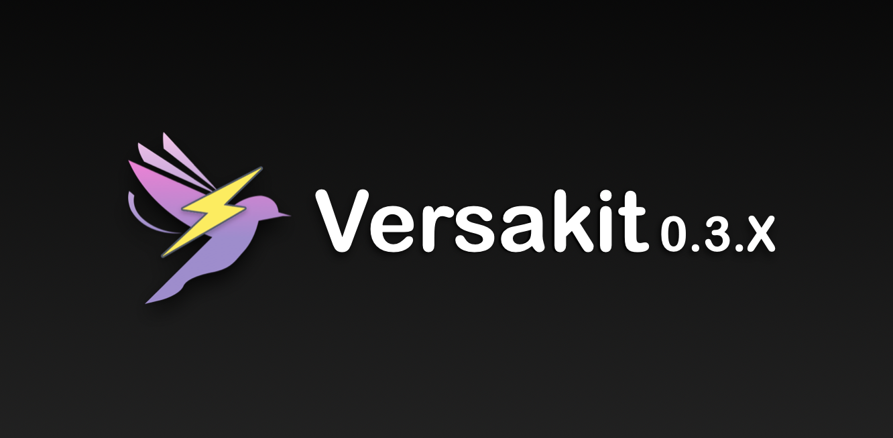

<table>
  <tr>
    <td>
      <picture>
        <source media="(prefers-color-scheme: dark)" srcset="https://raw.githubusercontent.com/StriveToLearnCode/StriveToLearnCode/output/github-contribution-grid-snake-dark.svg">
        <source media="(prefers-color-scheme: light)" srcset="https://raw.githubusercontent.com/StriveToLearnCode/StriveToLearnCode/output/github-contribution-grid-snake.svg">
        
      </picture>
    </td>
    <td>
        
    </td>
  </tr>
</table>

##  Hi I am StriveToLearnCode 👋

Here are some ideas to get you started:

🔭 I’m currently working on web front-end development.  
🤔 I’m looking for help with finding a suitable job.  
💬 Ask me about anything.

📫 How to reach me:

- 📧 Email: [xinyahuang@88.com](mailto:xinyahuang@88.com)
- 📱 WeChat: hxy1747274890
- ⚡ Fun fact: I love coding challenges!

<!--
**StriveToLearnCode/StriveToLearnCode** is a ✨ _special_ ✨ repository because its `README.md` (this file) appears on your GitHub profile.

Here are some ideas to get you started:

- 🔭 I’m currently working on ...
- 🌱 I’m currently learning ...
- 👯 I’m looking to collaborate on ...
- 🤔 I’m looking for help with ...
- 💬 Ask me about ...
- 📫 How to reach me: ...
- 😄 Pronouns: ...
- ⚡ Fun fact: ...
-->
